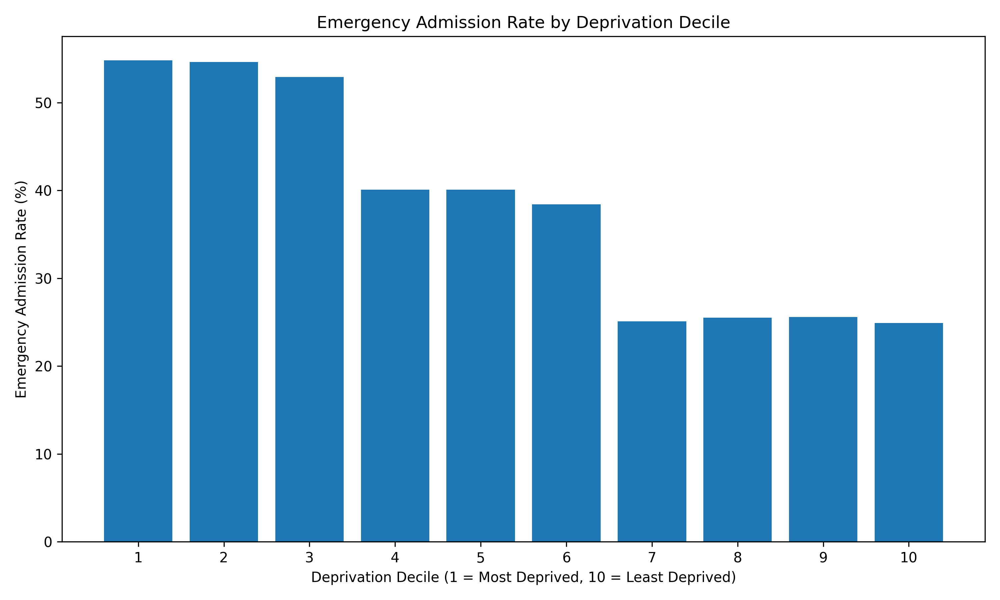
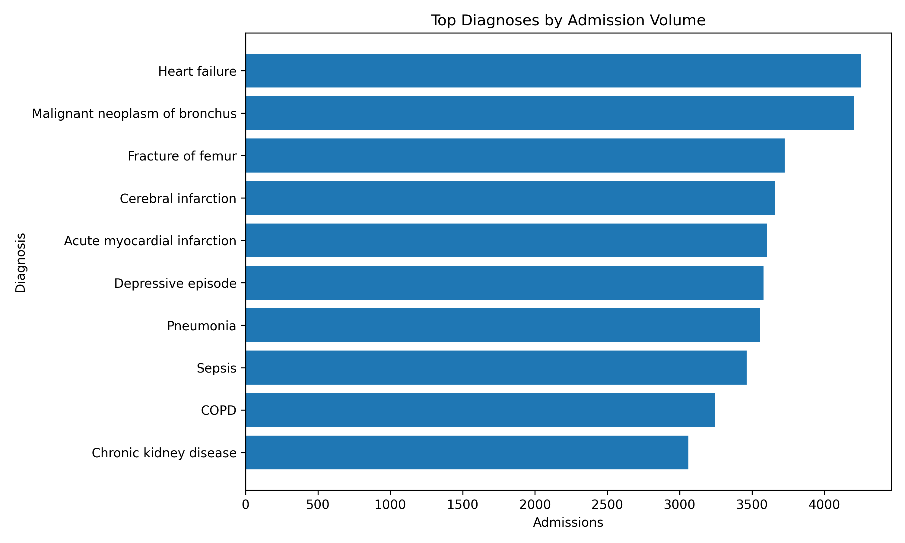
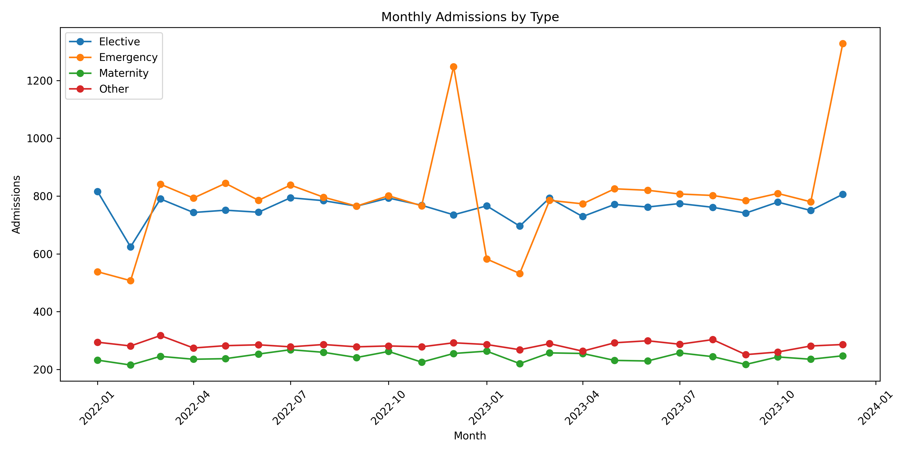
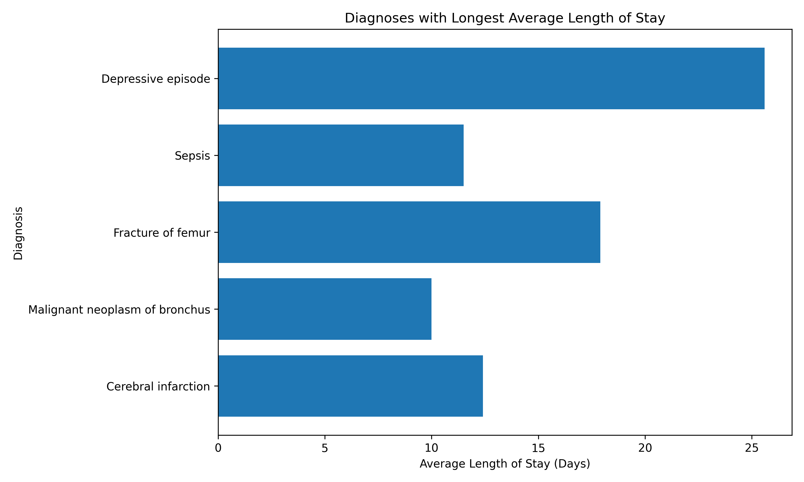

# NHS Hospital Admissions Analysis

## Overview

This project simulates a real-world NHS healthcare analytics workflow using SQL, PostgreSQL, AWS RDS, and Python. A synthetic dataset modelled on NHS Hospital Episode Statistics (HES) was generated and loaded into a cloud-hosted PostgreSQL database. Analytical SQL queries were then used to investigate admission patterns, healthcare inequalities, diagnosis prevalence, and length-of-stay metrics.

The project demonstrates end-to-end data engineering and analytics skills, including database design, cloud deployment, SQL analysis, automated data loading, and data visualisation.

---

## Technologies Used

- SQL
- PostgreSQL
- AWS RDS
- Python
- pandas
- matplotlib
- psycopg2
- Docker
- Git & GitHub
- pytest

---

## Project Architecture

```text
Synthetic Data Generation
            ↓
      PostgreSQL
        (AWS RDS)
            ↓
       SQL Analysis
            ↓
      Python Analytics
            ↓
      Visualisations
            ↓
    GitHub Portfolio
```

---

## Database Schema

The database consists of four relational tables:

### Patients

Stores demographic and socioeconomic information.

| Column | Description |
|----------|-------------|
| patient_id | Unique patient identifier |
| age | Patient age |
| sex | Male/Female |
| region | NHS region |
| deprivation_decile | Index of Multiple Deprivation decile |

### Admissions

Stores hospital admission events.

| Column | Description |
|----------|-------------|
| admission_id | Unique admission identifier |
| patient_id | Foreign key to patients |
| admission_date | Admission date |
| discharge_date | Discharge date |
| admission_type | Emergency, Elective, Maternity, Other |

### Diagnoses

Stores ICD-10 diagnosis records.

| Column | Description |
|----------|-------------|
| diagnosis_id | Unique diagnosis identifier |
| admission_id | Foreign key to admissions |
| icd10_code | ICD-10 diagnosis code |
| diagnosis_desc | Diagnosis description |
| is_primary | Primary diagnosis indicator |

### Treatments

Stores treatment information.

| Column | Description |
|----------|-------------|
| treatment_id | Unique treatment identifier |
| admission_id | Foreign key to admissions |
| treatment_name | Treatment description |

---

## Dataset Summary

| Table | Records |
|---------|---------:|
| Patients | 10,000 |
| Admissions | 50,000 |
| Diagnoses | 100,133 |
| Treatments | 75,563 |

---

## Analytical Questions

This project investigates:

- Which diagnoses account for the largest admission burden?
- How does length of stay vary by diagnosis?
- How do emergency admission rates vary by deprivation level?
- Are there observable seasonal trends in admissions?
- Which diagnoses are most likely to result in same-day discharge?
- Which diagnoses have the longest average hospital stay?

---

## SQL Techniques Demonstrated

### Common Table Expressions (CTEs)

```sql
WITH diagnosis_counts AS (
    SELECT
        diagnosis_desc,
        COUNT(*) AS admissions
    FROM diagnoses
    GROUP BY diagnosis_desc
)
```

### Window Functions

```sql
RANK() OVER (
    PARTITION BY region
    ORDER BY admission_count DESC
)
```

```sql
LAG(admissions) OVER (
    PARTITION BY admission_type
    ORDER BY admission_month
)
```

```sql
NTILE(4) OVER (
    ORDER BY avg_los
)
```

```sql
PERCENTILE_CONT(0.5)
WITHIN GROUP (
    ORDER BY los_days
)
```

---

## Key Findings

### Healthcare Inequality

Emergency admission rates showed a strong deprivation gradient:

| Deprivation Decile | Emergency Admission Rate (%) |
|--------------------|-----------------------------:|
| 1 (Most Deprived) | 54.8 |
| 10 (Least Deprived) | 24.9 |

**Key Result**

> Emergency admission rates were 29.9 percentage points higher in the most deprived decile compared with the least deprived decile.

---

### Diagnoses with Longest Average Length of Stay

| Diagnosis | Average LOS (Days) |
|------------|-------------------:|
| Depressive Episode | 25.6 |
| Fracture of Femur | 17.9 |
| Cerebral Infarction | 12.4 |
| Sepsis | 11.5 |
| Malignant Neoplasm of Bronchus | 10.0 |

---

### Most Common Diagnoses

Examples of high-volume diagnoses:

- COPD
- Fracture of Femur
- Heart Failure
- Lung Cancer
- Stroke
- Pneumonia

---

## Visualisations

### Emergency Admission Rate by Deprivation



### Top Diagnoses by Admission Volume



### Monthly Admissions by Type



### Diagnoses with Longest Average Length of Stay



---

## Running the Project

### Clone Repository

```bash
git clone https://github.com/yourusername/nhs-admissions-analysis.git
cd nhs-admissions-analysis
```

### Install Dependencies

```bash
pip install -r requirements.txt
```

### Configure Environment Variables

Create a `.env` file:

```env
AWS_RDS_HOST=<your-rds-endpoint>
AWS_RDS_DB=nhs_admissions
AWS_RDS_USER=postgres
AWS_RDS_PASSWORD=<your-password>
AWS_RDS_PORT=5432
```

### Generate and Load Data

```bash
python src/load_data.py
```

### Execute SQL Analysis

```bash
python src/run_queries.py
```

---

## Project Structure

```text
nhs-admissions-analysis/
│
├── data/
├── notebooks/
├── outputs/
│   └── charts/
├── sql/
│   ├── schema.sql
│   ├── 01_top_diagnoses.sql
│   ├── 02_length_of_stay.sql
│   ├── 03_deprivation_analysis.sql
│   ├── 04_admission_trends.sql
│   ├── 05_same_day_discharge.sql
│   └── 06_diagnosis_los_ranking.sql
│
├── src/
│   ├── generate_data.py
│   ├── load_data.py
│   └── run_queries.py
│
├── tests/
├── requirements.txt
├── Dockerfile
└── README.md
```

---

## Skills Demonstrated

- Relational Database Design
- PostgreSQL Administration
- AWS RDS Deployment
- SQL Analytics
- Data Engineering
- Python Data Analysis
- Healthcare Analytics
- Cloud Data Pipelines
- Git Version Control
- Automated Testing

---

## Future Improvements

- Streamlit dashboard
- NHS Open Data integration
- Predictive modelling for length of stay
- Docker deployment
- Airflow ETL orchestration
- Healthcare KPI dashboard

---

## Author

**Hamsathvani Aravinthan**

Credit Strategy Analyst | BSc Biochemistry | Aspiring Bioinformatician & Data Scientist

**Skills:** SQL • PostgreSQL • AWS • Python • Data Engineering • Healthcare Analytics
